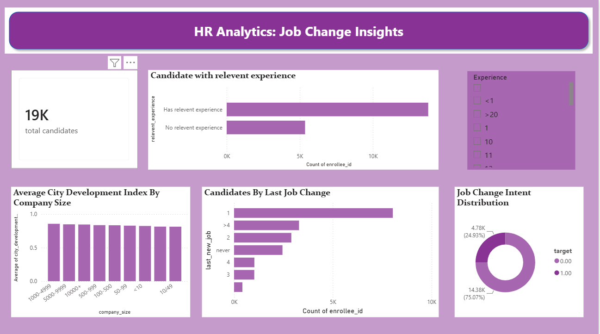

# HR Analytics Job Change Insights Dashboard

## 📌 Project Overview

The **HR Analytics Job Change Insights Dashboard** is an interactive Power BI project designed to analyze candidate profiles and identify job change patterns.

This dashboard helps understand how factors such as work experience, relevant experience, company size, city development index, last job change, and job change intent are connected.

---

## 🚀 Dashboard Features

- Total Candidate Overview
- Candidates by Relevant Experience
- Average City Development Index by Company Size
- Candidates by Last Job Change
- Job Change Intent Distribution
- Interactive Experience Slicer

---

## 📊 Key Insights

- Analyze candidates based on work experience and relevant experience.
- Compare company size using average city development index.
- Understand candidate distribution by last job change.
- Filter data dynamically using the experience slicer.
- Identify candidates likely to switch jobs.

---

## 🛠️ Tools & Technologies Used

- Power BI
- Power Query
- DAX
- Excel / CSV Dataset

---

## 📂 Dataset Columns

- enrollee_id
- city
- city_development_index
- gender
- relevent_experience
- education_level
- major_discipline
- experience
- company_size
- company_type
- last_new_job
- training_hours
- target

---

## 🖼️ Dashboard Preview

---

## ✨ Project Highlights

- Interactive Dashboard
- Data Cleaning using Power Query
- DAX Measures
- Dynamic Slicers
- HR Analytics Insights
- Business-Oriented Visualizations

---

## 📚 Learning Outcomes

- Data Cleaning
- Data Visualization
- Power Query
- DAX
- Interactive Dashboard Design
- Business Intelligence

---

## 👩‍💻 Author

**Tanvi Pandey**

BCA (Data Science & Artificial Intelligence)

Aspiring Data Analyst
